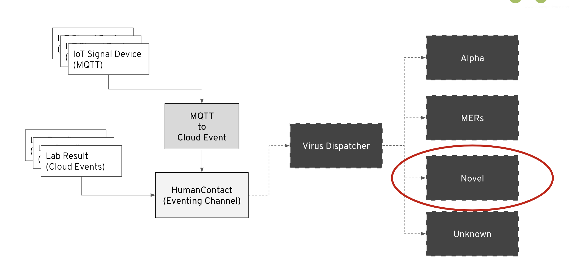

# Corona Virus Demo




## Folder Structure

```
--Setup (CRDs and k8s resources)
-- src
	|--VirusDispatcher	(Dispatch lab result to handlers through Channel)
	|--channel (Knative Channel to receive events)
		|--Alpha
		|--Mers
		|--Unknown
		|--Noval (COVID-19)
	|--handlers (Handlers that send notice to Dashboard by channel events)
		|--Alpha
		|--Mers
		|--Unknown
		|--Noval (COVID-19)
	|--Simulator
		|--SimulatorSend (Send fake lab data)
		|--Dashboard (Send notification to Dashboard)
		|--SimulatorCloudEvent (RC 1- Problem with two Camel K
		operators)
-- ui
```
## Setup Base Environment
Install Operators

1. OpenShift Serverless Operator
1. Knative Eventing Operator
1. AMQ Streams
1. Camel K

Create Project to setup AMQ Streams(Kafka):

```bash
oc new-project streams
```

Create the Kafka Cluster cluster under streams project:

```bash
cd setup
oc create -f kafka_cluster.yaml
```

```bash
apiVersion: kafka.strimzi.io/v1beta1
kind: Kafka
metadata:
  name: my-cluster
  namespace: streams
spec:
  kafka:
    config:
      offsets.topic.replication.factor: 3
      transaction.state.log.replication.factor: 3
      transaction.state.log.min.isr: 2
      log.message.format.version: '2.5'
    version: 2.5.0
    storage:
      type: ephemeral
    replicas: 3
    listeners:
      plain:
        authentiation:
          type: scram-sha-512
      tls:
        authentiation:
          type: tls
  entityOperator:
    topicOperator:
      reconciliationIntervalSeconds: 90
    userOperator:
      reconciliationIntervalSeconds: 120
  zookeeper:
    storage:
      type: ephemeral
    replicas: 3

```

And also create the Kafka Topic:

```bash
oc create -f kafka_topic.yaml
```

```bash
apiVersion: kafka.strimzi.io/v1beta1
kind: KafkaTopic
metadata:
  name: my-topic
  labels:
    strimzi.io/cluster: my-cluster
  namespace: streams
spec:
  config:
    retention.ms: 604800000
    segment.bytes: 1073741824
  partitions: 10
  replicas: 3

```

Create the Knative Serving if not existed:

```bash
oc create -f knative_serving_ns.yaml
```

```bash
apiVersion: v1
kind: Namespace
metadata:
 name: knative-serving
```

```bash
oc create -f knative_serving.yaml
```

```bash
apiVersion: serving.knative.dev/v1alpha1
kind: KnativeServing
metadata:
 name: knative-serving
 namespace: knative-serving                       
```


Create the Knative Eventing if not existed:

```bash
oc create -f knative_eventing_ns.yaml
```

```bash
apiVersion: v1
kind: Namespace
metadata:
 name: knative-eventing
```

```bash
oc create -f knative_eventing.yaml
```

```bash
apiVersion: operator.knative.dev/v1alpha1
kind: KnativeEventing
metadata:
  name: knative-eventing
  namespace: knative-eventing
spec: {}            
```


Create namespece for the demo:

```bash
oc new-project outbreak
```

Create Camel K Integration Platform:

```bash
oc create -f integration_platform.yaml
```

```bash
apiVersion: camel.apache.org/v1
kind: IntegrationPlatform
metadata:
  name: example
  namespace: outbreak
spec: {}
```

## Install applications

Setup Dashboard:

```bash
oc new-app quay.io/weimeilin79/myui:latest --as-deployment-config
oc delete svc myui
oc expose dc myui --port=8080,8181
oc expose svc myui
```

Get your Dashboard location:

```bash
oc get route
```

### Setup application

#### Existing virus outbreak handler

- Setup Channel, under src/channel:

```bash
oc create -f channelalpha.yaml
oc create -f channelmers.yaml
oc create -f channelunknown.yaml
oc create -f channelnoval.yaml
```

- Install the existing virus outbreak handler, under src/handlers:

```bash
kamel run -d camel-jackson AlphaHandler.java
kamel run -d camel-jackson MersHandler.yaml
kamel run -d camel-jackson UnknownHandler.groovy
```

- Start dispatching virus result to handlers, under src/:

```bash
kamel run -d camel-jackson VirusDispatcher.java --dev
```


- Start sending in lab result, under src/simulator:

```bash
kamel run -d camel-jackson -d camel-bean SimulateSender.java
kamel run Dashboard.java
```

- Go to Dashboard to see the virus

#### Adding COVID-19 handler

- Install the new COVID19 outbreak handler, under src/handlers:

```bash
kamel run -d camel-jackson NovalHandler.java
```

- Update your VirusDispatcher.java under src/ add the following condition ***(You should be using DEV mode)***

```java
	      .when().simple("${body.genuses} == 'Novalvirus'")
             .marshal(jacksonDataFormat)
             .log("MERS - ${body}")
             .to("knative:channel/noval-handler")
```

- Go to Dashboard to see the new COVID 19 virus appears
